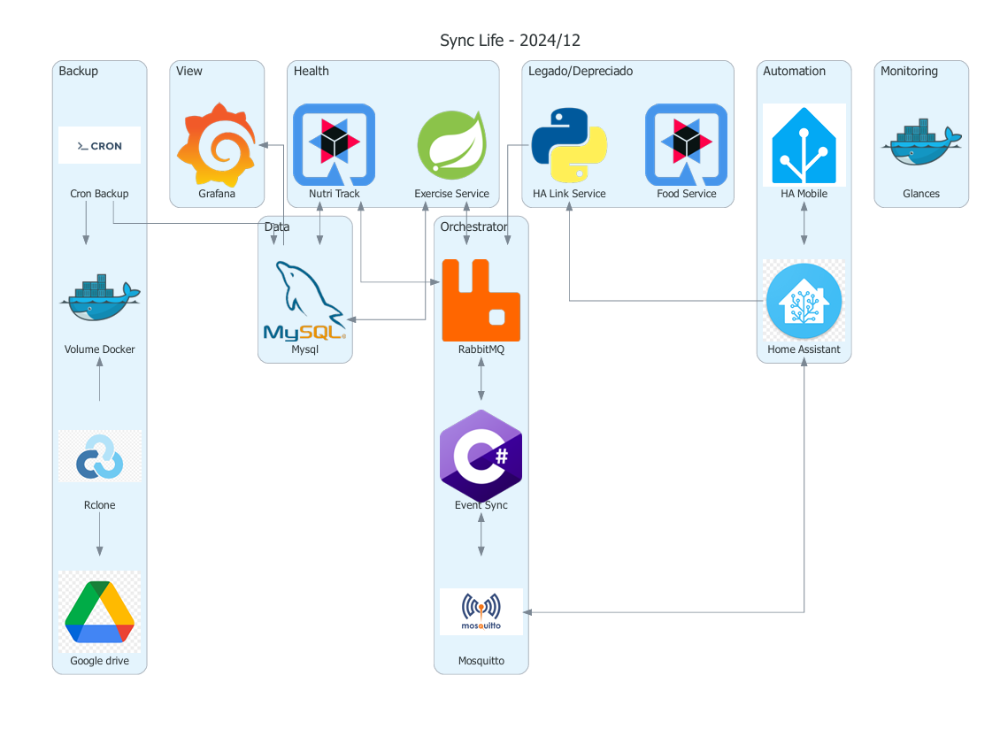

# Sobre

A ideia deste projeto é construir um eco sistema de dados e informações referente as minhas atividades diárias; 
utilizando as mais diversas ferramentas e aplicações diferentes. 
Idealmente quero utilizar frameworks e linguagens diferentes; 
então algumas escolhas não fazem sentido do ponto de vista de uma arquitetura ideal, porém o objetivo maior aqui é aprender.

## System designer

Foi definido as seguintes separações:
- **Conexto**: Um contexto tem varios dominios, cada contexto deve delimitar sua área conforme os dados.
- **Dominio**: É uma especificação dentro do contexto, onde deve limitar a algum dado em especifico.

#### Lista de aplicações na stack:
| Application                                                               | Context      | Description                                                                                            | Status        |
|---------------------------------------------------------------------------|--------------|--------------------------------------------------------------------------------------------------------|---------------|
| [BodyTrack]()                                                             | Health       | Aquilo que eu faço/tem haver com o meu corpo; medidas, atividades fisicas, mapeamento do sono e outros | Planejado     |
| [EventSync](https://github.com/alves-dev/SyncLife-Orchestrator-EventSync) | Orchestrator | Orquestra os eventos entre os protocolos MQTT e AMQP                                                   | Desenvolvendo |
| [Grafana](https://grafana.com/)                                           |              |                                                                                                        | -----         |
| [Mosquitto](https://mosquitto.org/)                                       | Orchestrator |                                                                                                        | -----         |
| [NutriTrack](https://github.com/alves-dev/SyncLife-Health-NutriTrack)     | Health       | Tudo aquilo que eu ingiro; água, comida, suplementos e outros                                          | Desenvolvendo |
| [RabbitMQ](https://www.rabbitmq.com/)                                     | Orchestrator | [Eventos](events.md)                                                                                   | -----         |

#### Aplicações e suas tecnologias:
| Application                                                               | Language | Framework | Others  |
|---------------------------------------------------------------------------|----------|-----------|---------|
| [BodyTrack]()                                                             |          |           |         |
| [EventSync](https://github.com/alves-dev/SyncLife-Orchestrator-EventSync) | C#       | .NET      |         |
| [NutriTrack](https://github.com/alves-dev/SyncLife-Health-NutriTrack)     | Java     | Quarkus   | gradlew |

### Diagrama

-----
- **Updated on**: 2024-12-21 | **Updated by**: Igor Alves
- **Created on**: 2024-10-29 | **Created by**: Igor Alves
