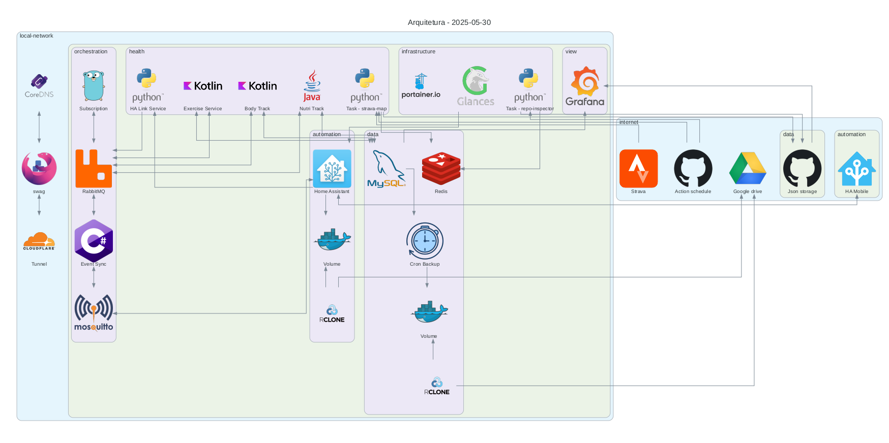

# Sobre

A ideia deste projeto é construir um eco sistema de dados e informações referente as minhas atividades diárias; 
utilizando as mais diversas ferramentas e aplicações diferentes. 
Idealmente quero utilizar frameworks e linguagens diferentes; 

Dado o contexto algumas escolhas não faram sentido do ponto de vista de uma arquitetura ideal, porém o objetivo maior aqui é aprender.

## System designer

Foi definido as seguintes separações:
- **Conexto**: Um contexto tem varios dominios, cada contexto deve delimitar sua área conforme os dados.
- **Dominio**: É uma especificação dentro do contexto, onde deve limitar a algum dado em especifico.

#### Lista de aplicações na stack:
| Application                                                               | Context      | Description                                                                                            | Status        |
|---------------------------------------------------------------------------|--------------|--------------------------------------------------------------------------------------------------------|---------------|
| [BodyTrack](https://github.com/alves-dev/SyncLife-Health-BodyTrack)       | Health       | Aquilo que eu faço/tem haver com o meu corpo; medidas, atividades físicas, mapeamento do sono e outros | Desenvolvendo |
| [EventSync](https://github.com/alves-dev/SyncLife-Orchestrator-EventSync) | Orchestrator | Orquestra os eventos entre os protocolos MQTT e AMQP                                                   | Desenvolvendo |
| [Grafana](https://grafana.com/)                                           | View         | Ferramenta usada para visualização dos dados em forma de gráficos                                      | -----         |
| [Mosquitto](https://mosquitto.org/)                                       | Orchestrator | Broker MQTT para comunicação com o Home Assistant                                                      | -----         |
| [MySQL](https://www.mysql.com/)                                           | Data         | Banco de dados relacional                                                                              | -----         |
| [NutriTrack](https://github.com/alves-dev/SyncLife-Health-NutriTrack)     | Health       | Tudo aquilo que eu ingiro, como; água, comida, suplementos e outros                                    | Desenvolvendo |
| [RabbitMQ](https://www.rabbitmq.com/)                                     | Orchestrator | Ferramenta usada para fila de eventos, mais em : [eventos](events.md)                                  | -----         |

#### Aplicações e suas tecnologias:
| Application                                                               | Language | Framework   | Others  |
|---------------------------------------------------------------------------|----------|-------------|---------|
| [BodyTrack](https://github.com/alves-dev/SyncLife-Health-BodyTrack)       | Kotlin   | Spring Boot | gradlew |
| [EventSync](https://github.com/alves-dev/SyncLife-Orchestrator-EventSync) | C#       | .NET        |         |
| [NutriTrack](https://github.com/alves-dev/SyncLife-Health-NutriTrack)     | Java     | Quarkus     | gradlew |

### Diagramas

Para ver a evolução acesse: [diagrama/out_pdf](diagrama/out_pdf)

-----
- **Updated on**: 2025-02-07 | **Updated by**: Igor Alves
- **Created on**: 2024-10-29 | **Created by**: Igor Alves
