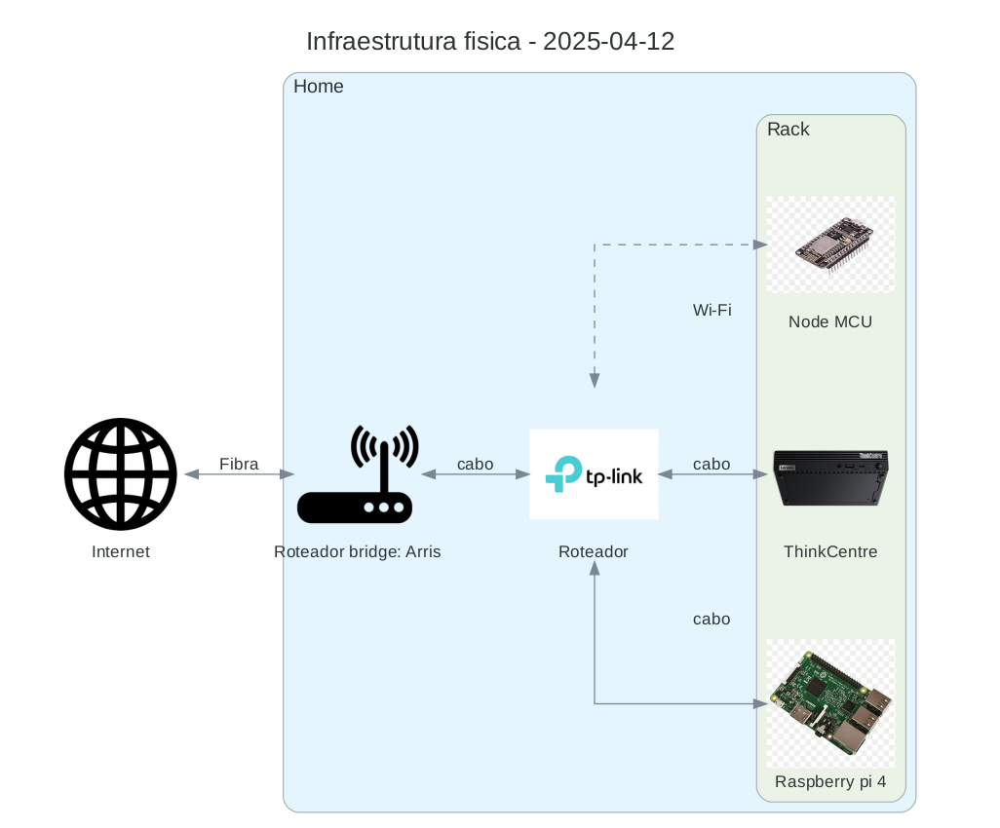

# Sobre

A ideia deste projeto é construir um eco sistema de dados e informações referente as minhas atividades diárias; 
utilizando as mais diversas ferramentas e aplicações diferentes. 
Idealmente quero utilizar frameworks e linguagens diferentes; 

Dado o contexto algumas escolhas não faram sentido do ponto de vista de uma arquitetura ideal, porém o objetivo maior aqui é aprender.

## System designer

Foi definido as seguintes separações:
- **domínio**: Um domínio pode ter vários sub-domínios, cada domínio deve delimitar sua área conforme os dados.
- **sub-domínio**: É uma especificação dentro do domínio, onde deve limitar a algum dado em específico.

| Domínio        | Sub domínio       | Description                                  |
|----------------|-------------------|----------------------------------------------|
| health         | sleep             | Responsável por mapear o sono                |
| health         | exercise          | Trata dos exercícios físicos                 |
| health         | nutrition         | Nutrição, alimentos líquidos e sólidos       |
| view           | view              | Aplicações pra visualização de dados         |
| data           | data              | Ferramentas que lida com dados, como o mysql |
| health         | supplementation   | Suplementos como creatina, whey, etc         |
| health         | body-measurements | Medidas de membros e peso                    |
| financial      | -----             | -----                                        |
| automation     | tracking          | Rastreamento de pessoas                      |
| orchestration  | subscription      | Lida com a orquestração de eventos           |
| vehicle        | -----             | -----                                        |
| infrastructure | servers           | -----                                        |
| infrastructure | network           | -----                                        |
| infrastructure | github            | -----                                        |

- Uma aplicação pode lidar com mais de um sub domínio.
- ----- significa que ainda não foi completamente mapeado e não tem aplicação que lide com isso.

#### Lista de aplicações na stack:
| Application                                                                                         | Domínio          | Sub domínio | Description                                                                     |
|-----------------------------------------------------------------------------------------------------|------------------|-------------|---------------------------------------------------------------------------------|
| [BodyTrack](https://github.com/alves-dev/SyncLife-Health-BodyTrack)                                 | health           | sleep       | ---                                                                             |
| [NutriTrack](https://github.com/alves-dev/SyncLife-Health-NutriTrack)                               | health           | nutrition   | ---                                                                             |
| [life-exercises](https://github.com/alves-dev/life-exercises)                                       | health           | exercise    | Atualmente registra as idas na academia                                         |
| [assistant-link](https://github.com/alves-dev/life-assistant-link)                                  | health           | exercise    | Legado que cria eventos a partir de request http do HA                          |
| [EventSync](https://github.com/alves-dev/SyncLife-Orchestrator-EventSync)                           | orchestration    | ---         | Orquestra os eventos entre os protocolos MQTT e AMQP                            |
| [Mosquitto](https://mosquitto.org/)                                                                 | orchestration    | ---         | Broker MQTT para comunicação com o Home Assistant                               |
| [RabbitMQ](https://www.rabbitmq.com/)                                                               | orchestration    | ---         | Ferramenta usada para fila de eventos, mais em : [eventos](events/events_v2.md) |
| [Grafana](https://grafana.com/)                                                                     | view             | ---         | Ferramenta usada para visualização dos dados em forma de gráficos               |
| [MySQL](https://www.mysql.com/)                                                                     | data             | ---         | Banco de dados relacional                                                       |
| [cron-backup](https://hub.docker.com/r/fradelg/mysql-cron-backup)                                   | data             | ---         | Realiza o backup do banco mysql                                                 |
| [rclone](https://rclone.org/)                                                                       | data, automation | ---         | Copia os backups locais para a nuvem                                            |
| [home assistant](https://www.home-assistant.io/)                                                    | automation       | ---         | Usado para automações                                                           |
| [home assistant app mobile](https://www.home-assistant.io/integrations/mobile_app/)                 | automation       | ---         | App mobile do HA                                                                |
| [coredns](https://coredns.io/)                                                                      | infrastructure   | network     | Servidor DNS interno                                                            |
| [swag](https://docs.linuxserver.io/general/swag/)                                                   | infrastructure   | network     | Proxy reverso                                                                   |
| [Cloudflare Tunnel](https://developers.cloudflare.com/cloudflare-one/connections/connect-networks/) | infrastructure   | network     | Usado para expor aplicações na internet                                         |
| [glances](https://nicolargo.github.io/glances/)                                                     | infrastructure   | ---         | Monitoramento linux                                                             |
| [portainer](https://www.portainer.io/)                                                              | infrastructure   | ---         | Monitoramento docker                                                            |
| [Google Drive](https://developers.google.com/workspace/drive?hl=pt-br)                              | data             | ---         | Armazenamento de backups                                                        |

#### Aplicações e suas tecnologias:
| Application                                                               | Language | Framework   | Others                                                                       |
|---------------------------------------------------------------------------|----------|-------------|------------------------------------------------------------------------------|
| [BodyTrack](https://github.com/alves-dev/SyncLife-Health-BodyTrack)       | Kotlin   | Spring Boot | [gradle](https://gradle.org/)                                                |
| [EventSync](https://github.com/alves-dev/SyncLife-Orchestrator-EventSync) | C#       | .NET        |                                                                              |
| [NutriTrack](https://github.com/alves-dev/SyncLife-Health-NutriTrack)     | Java     | Quarkus     | [gradle](https://gradle.org/)                                                |
| [life-exercises](https://github.com/alves-dev/life-exercises)             | Kotlin   |             |                                                                              |
| [assistant-link](https://github.com/alves-dev/life-assistant-link)        | Python   | Spring Boot | [gradle](https://gradle.org/), [Testcontainers](https://testcontainers.com/) |

### Diagramas

Para ver a evolução acesse: [diagrama/out_pdf](diagrama/out_pdf)

-----
- **Updated on**: 2025-04-21 | **Updated by**: Igor Alves
- **Created on**: 2024-10-29 | **Created by**: Igor Alves
